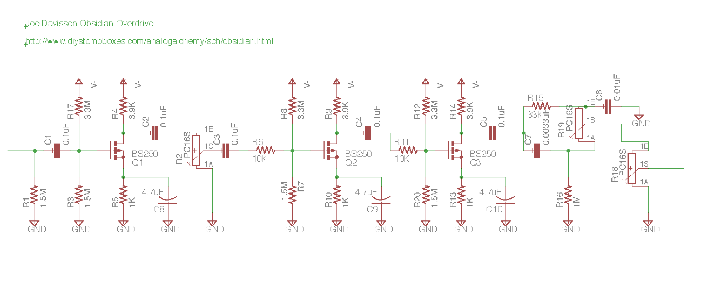

Joe Davisson Obsidian Overdrive
===============================

Original design Copyright © 2009 Joe Davisson.
Schematic from [AnalogAlchemy](http://www.diystompboxes.com/analogalchemy/sch/obsidian.html)

I'm just drawing this out to create a PCB for myself. Original work here is licensed under Creative Commons, use it if it's useful to you.

Original content from Joe:

Obsidian
--------
This distortion unit uses three MOSFET gain stages followed by a simple Big-Muff style tone control. It is a positive-ground circuit, so it should be powered with a battery. It doesn't draw much power anyway.
It's important to build the circuit on a breadboard first, as the MOSFETs will usually require re-biasing. Adjust the 3.9k resistors until the drains are at approximately 4.5v. This doesn't have to be exact, anywhere between 4-5 volts is fine.

The circuit may also be built in a normal negative-ground configuration, using 2N7000 or BS170 devices. However, there will be a higher level of background noise.

Copyright © 2009 Joe Davisson. All Rights Reserved.

Preview
-------

Parts Libs
----------
Don't know how these work with regards to embedding in an Eagle schematic or board... so linking to them to avoid losing track.
[MusicThingModular.lbr](https://raw.githubusercontent.com/TomWhitwell/MTM-Parts-Library/master/MusicThingModular.lbr)
[audio.lbr](https://raw.githubusercontent.com/robertstarr/lbr_user/master/audio.lbr)
